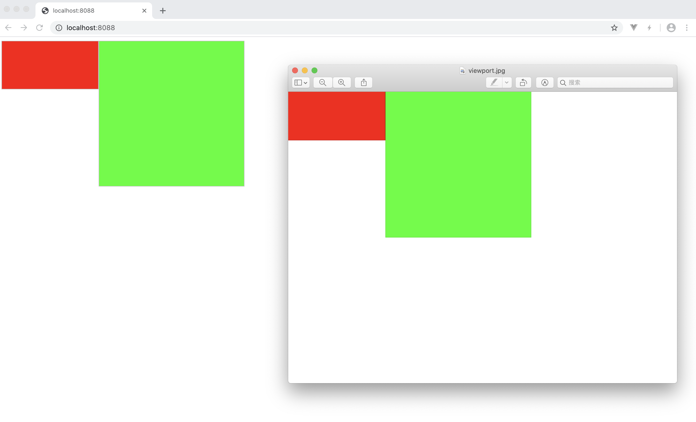

# 玩具浏览器

为更好了解浏览器工作原理，实现一个玩具浏览器。

最终结果：

本项目与 [实现一个玩具浏览器](https://blog.xuyimingwork.com/tag/%E5%AE%9E%E7%8E%B0%E4%B8%80%E4%B8%AA%E7%8E%A9%E5%85%B7%E6%B5%8F%E8%A7%88%E5%99%A8/) 系列博文同步进行。本项目极力确保每次提交后程序可以执行，可切换至各提交查看各阶段代码与输出。

> 注：本项目及博文源自 [Winter-浏览器工作原理](https://u.geekbang.org/subject/fe/1000447)